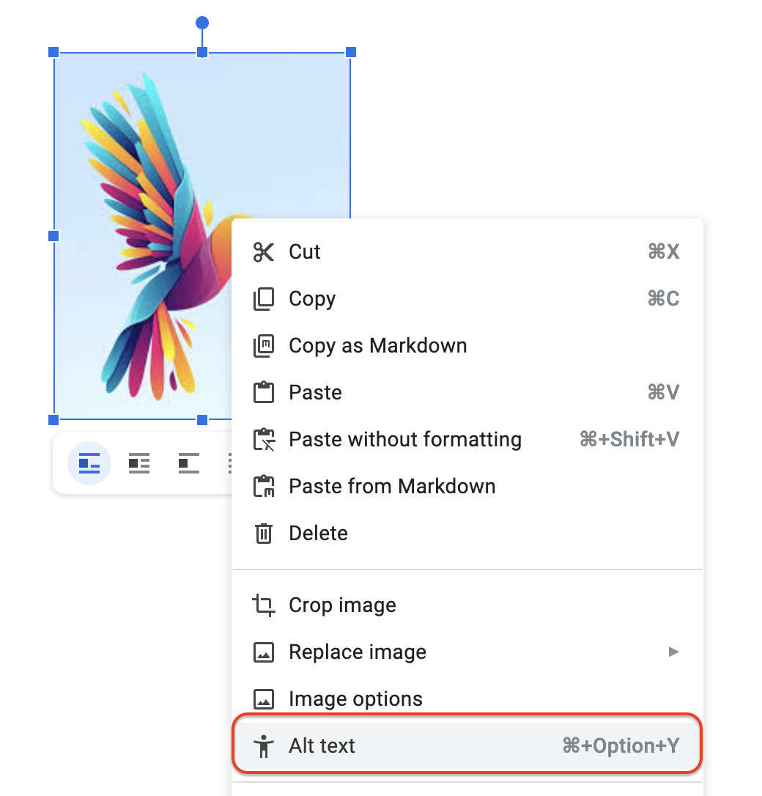
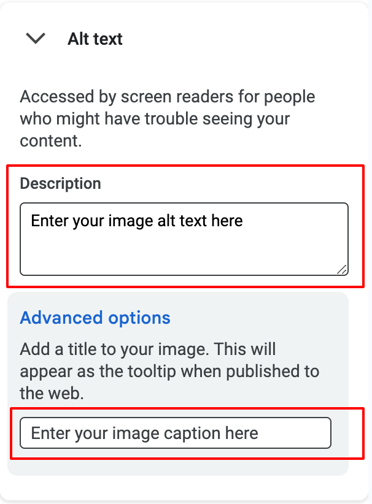

Adding captions to images in Google Docs not only improves the clarity and context of your content but also enhances accessibility and SEO. 

In this article, I'll explain how to add caption to images in Google Docs and show you how to export the document as Markdown or HTML with images and captions for publishing.

Images can have two key elements: **captions** and **alt text**. Knowing how to use each one properly is important for making your content both accessible and engaging.

<!-- toc -->

## What is Alt Text and When to Use It

Alt text, also known as alternative text or [alt description](https://blog.hubspot.com/marketing/image-alt-text), is a short text description that is associated with an image. 

It serves two primary purposes:

1. **Accessibility** - It provides information about the image for visually impaired users who rely on screen readers. These tools read the alt text aloud, helping users understand the image content.
2. **SEO** - Search engines use alt text to understand the content of an image, which can improve search engine rankings for relevant keywords.

Effective alt text should concisely describe the image's content, including the subject, action, and context. It's essential to avoid keyword stuffing and focus on providing meaningful information.

## What is Image Title or Image Caption and When to Use It

An image title or [image caption](https://www.w3schools.com/tags/tag_figcaption.asp) is a brief text that accompanies an image, usually placed below or above it. Unlike alt text, which is primarily for accessibility and SEO, image titles or captions serve a different purpose:

1. **Explanation** - They provide additional context or information about the image, such as who or what is depicted, when it was taken, or where it was captured.
2. **Engagement** - They can help draw attention to the image and encourage viewers to explore the content further.

Image titles and captions can be used interchangeably, but some platforms may differentiate between them. For example, a title might be a short descriptive phrase, while a caption could be a more detailed explanation.

## How to Add Image Captions in Google Docs

1. **Insert your image** - Click on *Insert* -> *Image* and choose your image file.
2. **Add the caption** - To add caption to an image, right click on the image and click on the *Alt text* option as shown in the below image. 

The image options sidebar will be opened. Enter the *Alt text* and the image caption/title in the respective text boxes as shown below. 

The image caption and the alt text will be saved automatically.

## Preserving Image Captions in Markdown and HTML output while Publishing Google Docs

When publishing your content, you'll need to [convert Google Docs to Markdown or HTML](/convert-google-docs-to-markdown/). However, the native Google Docs export options have some limitations.

The Markdown export includes images as Base64 text reference within the Markdown files, while the HTML export includes unnecessary HTML and CSS code, requiring you to manually download and re-upload the images.

To avoid these issues, you can use the **Docs to Markdown Pro add-on**. It exports Google Docs content as Markdown format, includes image files in a zip folder, and preserves [image alt text and captions in the Markdown output](/add-image-captions-to-images-in-jekyll-blog-posts-with-markdown/), making the Markdown or HTML ready for publishing.

## Conclusion

Alt text and image captions enhance the accessibility and quality of your content. Alt text is essential for visually impaired users and SEO, while image captions provide additional context and engagement. By following the steps outlined above, you can add informative captions to your images in Google Docs.

When you're ready to publish, using an add-on to convert your Google Docs to Markdown or HTML ensures a seamless export process, preserves the image captions and alt text, and makes it easy to publish your content on the web or internal pages.