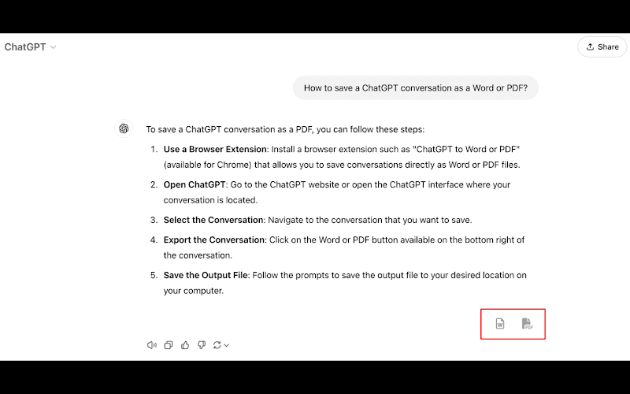
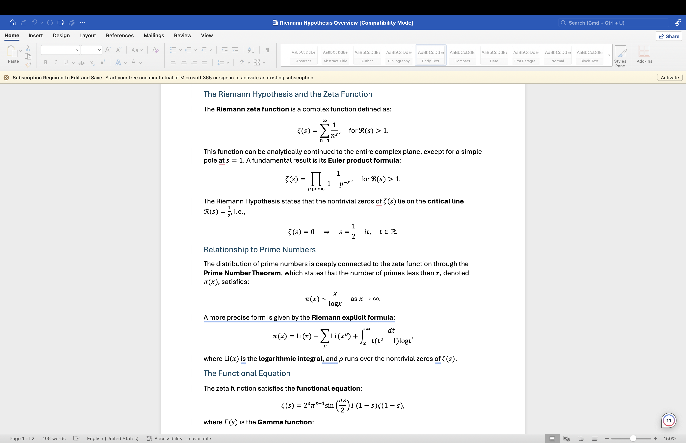
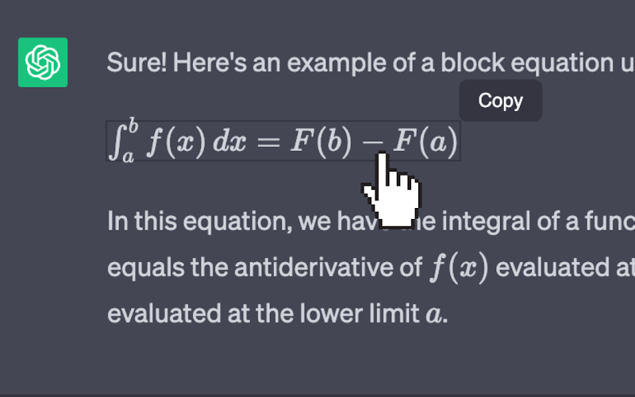
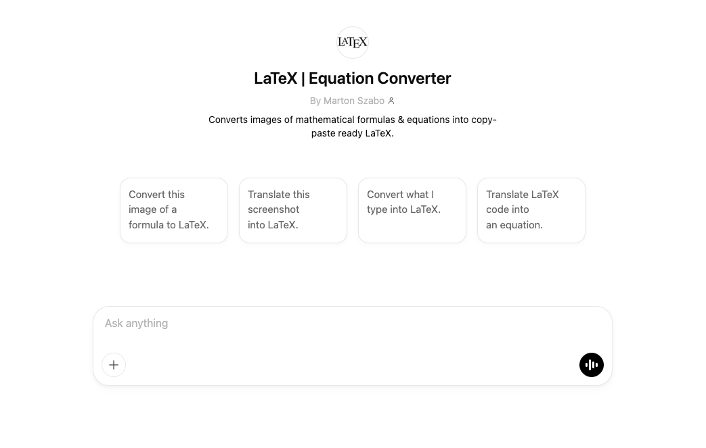

Mathematical and scientific discussions often rely on equations, but presenting them correctly in digital formats can be challenging. Initially, ChatGPT only provided raw LaTeX code, requiring users to manually copy and render it elsewhere. Now, with the integration of [KaTeX](https://katex.org/), ChatGPT can display equations directly, enhancing readability and usability.

While KaTeX improves the in-chat experience, users still need additional tools to transfer equations seamlessly into Word and Google Docs. The **[ChatGPT to Word](https://chromewebstore.google.com/detail/chatgpt-to-word-or-pdf/mjdmggegbkookpcmbdllcnbfboikcbop)** and **[ChatGPT to Google Docs](https://chromewebstore.google.com/detail/chatgpt-to-google-docs-or/oibghjgooccojibfacdonaoipegckdeg)** extensions help users easily export ChatGPT responses, including equations, into these platforms with proper formatting. 

Several other extensions and custom GPTs further streamline the process, catering to different needs. These tools eliminate the need for manual formatting, making it easier for students, researchers, and professionals to include mathematical content in their documents.

<!-- toc -->

## Rendering ChatGPT Equations Using ChatGPT to Word Chrome Extension

This section discusses the **ChatGPT to Word or PDF** Chrome extension, which allows you to convert ChatGPT responses, including equations, into LaTeX without loosing formatting.

<a href="https://chromewebstore.google.com/detail/chatgpt-to-word-or-pdf/mjdmggegbkookpcmbdllcnbfboikcbop" target="_blank" aria-label="Get it from the Google Chrome Webstore" rel="noopener">
          

            
          

        </a>

**What It Does**

- Converts ChatGPT responses, including rendered equations, into a properly formatted Word or a PDF document.
- Ensures [mathematical expressions](https://en.wikipedia.org/wiki/Expression_(mathematics)) appear as they should, without requiring manual LaTeX conversion.
- Preserves formatting, including fonts, tables, code blocks, spacing, and inline equations, ensuring professional-quality documents.
- Allows users to edit equations easily in Word using the built-in equation editor.
- Supports both **inline and block equations**, ensuring compatibility with academic and professional formatting standards.

When you convert the conversation into a Word File, the output word file with equations would look like the following: 

<a href="https://chromewebstore.google.com/detail/chatgpt-to-word-or-pdf/mjdmggegbkookpcmbdllcnbfboikcbop" target="_blank" aria-label="Get it from the Google Chrome Webstore" rel="noopener nofollow">
          

            
          

        </a>

**When to Use It**

Use this extension if you:
- Frequently export ChatGPT responses to **Microsoft Word** or **PDF** for reports, research papers, or assignments.
- Need to maintain proper equation formatting in documents without manually tweaking [LaTeX](https://www.latex-project.org/).
- Want a simple, automated way to handle equations without manual adjustments.
- Prefer working in Word rather than LaTeX editors.
- Need to **collaborate on Word documents** containing equations without formatting issues.

## Rendering ChatGPT Equations Using the ChatGPT Equation Renderer Chrome Extension

This section discusses the **ChatGPT Equation Renderer** Chrome extension, which allows users to render LaTeX equations directly within ChatGPT using KaTeX for improved readability and easy copying.

<a href="https://chromewebstore.google.com/detail/chatgpt-equation-renderer/nkkkaendbndanjjndfpebmekhgdjlhkh" target="_blank" aria-label="Get it from the Google Chrome Webstore" rel="noopener">
          

            
          

        </a>

**What It Does**

- Renders LaTeX equations directly within ChatGPT for improved readability, preventing the need to copy raw LaTeX code.
- Uses **KaTeX** for fast, accurate rendering of mathematical expressions, ensuring high-quality display.
- Provides an option to **copy and paste** rendered equations into Word, Google Docs, or other platforms.
- Supports inline and block equations, making it useful for users who need flexibility in formatting.
- Works efficiently even with **complex mathematical and scientific notations**, such as integrals, matrices, and differential equations.

> This extension allows users to copy equations one by one only. This may take more time when dealing with a large number of equations.

**When to Use It**

Choose this extension if you:
- Prefer to **see equations properly rendered** inside ChatGPT instead of raw LaTeX.
- Need a **quick way to copy** formatted equations one by one for use in external applications.
- Work with **complex mathematical expressions** that require precise formatting.
- Want to preview equations before copying them into another tool.
- Frequently work with **engineering, physics, or computer science** equations that need to be presented clearly.
- Want to copy equation only a few times.

## Rendering ChatGPT Equations Using Custom GPTs

This section discusses the **LaTeX | Equation Converter** Custom GPT, which converts images of mathematical formulas into editable LaTeX code, making it easier to digitize handwritten or scanned equations.

**What It Does**

- The [**LaTeX | Equation Converter**](https://chatgpt.com/g/g-oDmioY7gS-latex-equation-converter) Custom GPT can convert **images of mathematical formulas** into **copy-paste ready LaTeX code**, making it easier to work with scanned notes or textbook content.
- Helps users transition handwritten or printed equations into digital LaTeX format, avoiding the need to manually type complex equations.
- Uses OCR (Optical Character Recognition) to detect and extract mathematical symbols accurately.
- Supports batch conversion, allowing users to process multiple equations at once for efficiency.
- Provides an **editable LaTeX output**, allowing users to refine and customize equations before using them in documents.

**When to Use It**

This tool is ideal if you:
- Have **handwritten equations** or images of mathematical content that need to be converted quickly and accurately.
- Want to **extract mathematical expressions** from PDFs, scanned documents, or online sources.
- Need a **reliable way to digitize complex formulas** for further editing in LaTeX, Word, or Google Docs.
- Work in fields where mathematical notation is frequently handwritten or printed, such as academia and engineering.
- Need to **convert legacy documents** into digital formats for academic papers, technical reports, or online publishing.
- Want to analyze and repurpose mathematical content from research papers, making it easier to cite, modify, or integrate into new academic work.

## Conclusion

With the integration of **KaTeX**, ChatGPT now supports direct equation rendering, eliminating the need to interpret raw LaTeX code. Users can now work more efficiently without relying on external tools just to visualize mathematical expressions.

To enhance usability further:
- Use the **[ChatGPT to Word Extension](https://chromewebstore.google.com/detail/chatgpt-to-word-or-pdf/mjdmggegbkookpcmbdllcnbfboikcbop)** for seamless integration into Word documents, ensuring professional-quality formatting.
- Use the **[ChatGPT to Google Docs Extension](https://chromewebstore.google.com/detail/chatgpt-to-google-docs-or/oibghjgooccojibfacdonaoipegckdeg)** for exporting equations into Google Docs, making collaboration easier.
- Leverage the **[ChatGPT Equation Renderer Chrome Extension](https://chromewebstore.google.com/detail/chatgpt-equation-renderer/nkkkaendbndanjjndfpebmekhgdjlhkh)** to view and copy formatted equations within ChatGPT without needing manual LaTeX interpretation.
- Try the **[LaTeX | Equation Converter Custom GPT](https://chatgpt.com/g/g-oDmioY7gS-latex-equation-converter)** for converting images into LaTeX code, streamlining the digitization of handwritten or printed equations.

Each of these tools serves a specific purpose, ensuring that users can efficiently work with mathematical equations in ChatGPT and beyond, whether for academic, professional, or technical use.

