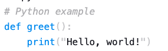
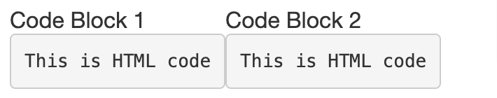

Markdown allows you to include formatted code blocks in your documents. These can be useful for displaying code snippets, configuration files, or other preformatted text.

**You can create code blocks in Markdown by wrapping the code with triple backtics (```).**

In this tutorial, I'll explain how to create *Fenced* and *Indented* code blocks in Markdown and when to use them, and also explain how to use the syntax highlighting in the Markdown code blocks and display line numbers.

<!-- toc -->

## Markdown Fenced Code blocks

Fenced code blocks are created by wrapping the code with triple backticks (```) or triple tildes (~~~).

The following syntax shows how to create a fenced code blocks: 

````
```
This is a fenced code block.
It is wrapped with triple backticks.
```
````

Use fenced code blocks `(```)` when:

- You have long code snippets - Fenced code blocks are better suited for longer stretches of code as they improve readability and avoid confusion with standard indentation in Markdown
- You need syntax highlighting - Most Markdown processors support syntax highlighting within fenced code blocks, making code easier to understand
- Your code contains mixed indentation - Fenced code blocks preserve the original indentation of your code, regardless of the surrounding text
- You want to specify the code language - You can add a language identifier after the opening triple backtick (```language) to instruct the processor to use specific syntax highlighting for that language

## Markdown Indented code blocks

Indented code blocks use a tab or four spaces at the beginning of each line to indicate that the text is a code block.

The following lines demonstrates the indented code blocks:

```
    This is an indented code block.
    Each line is preceded by four spaces or a tab.
```

Use indented code blocks (indented by 4 spaces or 1 tab) when:

- You have very short code snippets (one or two lines) - For quick code references, indented blocks can be a simpler option.

- Your Markdown processor doesn't support fenced code blocks - Some older or very basic Markdown processors might not recognize fenced code blocks

Read more about the [Code blocks](https://docs.github.com/en/get-started/writing-on-github/working-with-advanced-formatting/creating-and-highlighting-code-blocks) in the GitHub Flavoured Markdown. 

## Markdown Inline Code

[Inline code](https://developer.mozilla.org/en-US/docs/Web/HTML/Element/code) allows you to display short snippets of code **within your text without creating a separate code block**. It is wrapped in single backticks (`).

The following code demonstrates how to create an inline code:

```
For example: `print("Hello, world!")`
```

This will display the sentence as follows: 

For example: `print("Hello, world!")`


## Syntax highlighting in Markdown Code Blocks

Markdown supports [syntax highlighting](https://en.wikipedia.org/wiki/Syntax_highlighting) by specifying the language of the code block. **This feature enhances readability by color-coding the syntax.**

To add syntax highlighting, specify the language after the opening code fence (```) followed by the language name as shown below:

```
```python
# Python example
def greet():
    print("Hello, world!")
```

This will render the code block in colour as shown below: 



To explore the full list of supported languages for Markdown syntax highlighting, refer to the [Markdown supported languages list](https://github.com/jincheng9/markdown_supported_languages?tab=readme-ov-file#heres-a-full-list-of-supported-languages) on GitHub.

**Note:** Syntax highlighting capabilities vary depending on the specific platform you're using. It is recommended to read the docs accordingly.

## Nesting Code within a List in Markdown

You can nest code within a [list item](/lists-in-markdown/) using indentation or fenced code blocks. Make sure to indent the code block further than the list item itself to maintain proper formatting.

The following list shows how to nest a code within a list using Markdown:

- Compile the code
    ```bash
    gcc main.c -o main
    ```
- Run the program

    ```
    ./main
    ```

## Including Line Numbers in Markdown Code Blocks

Markdown doesn't support line numbers in code blocks natively. However, some Markdown processors allow adding them using plugins or extensions.

For example, if you're using [mkdocs](https://squidfunk.github.io/mkdocs-material/reference/code-blocks/#adding-line-numbers) as a static site generator and using Markdown to create documents, you can use the `linenums="<start>"` option after the short where the start denotes the starting line number. If you use 1, the code blocks line number will start from 1.

```
```python linenums="1"
def line_numbers_example():
    for i in range(10):
        print(i)
```

## Display Code Blocks Side By Side

While Markdown doesn't have a built-in way to [display code blocks side-by-side](https://github.com/yzhang-gh/vscode-markdown/issues/987), you can achieve this effect using HTML within your Markdown document. However,  be aware that this approach might not work on all platforms. 

```
<table>
  <tr>
    <td>Code Block 1</td>
    <td>Code Block 2</td>
  </tr>
  <tr>
    <td>
      <pre>This is HTML code</pre>
    </td>
    <td>
      <pre>This is HTML code</pre>
    </td>
  </tr>
</table>
```

This will render code blocks side by side as showing in the following image: 



### Security Considerations with HTML in Markdown

Including HTML from untrusted sources can introduce security vulnerabilities if not handled properly.  It's best to only use HTML from reliable sources within your Markdown documents.

## Conclusion

Markdown code blocks offer a powerful way to display and highlight code within your documents. This guide covered *fenced code blocks* (the recommended approach), *indented code blocks*, *inline code* for short snippets, and even explored options for including line numbers (achieved through plugins or extensions depending on your processor).

By understanding these features, you can effectively communicate code within your Markdown documents, improving readability and clarity for both you and your readers.