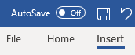
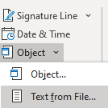
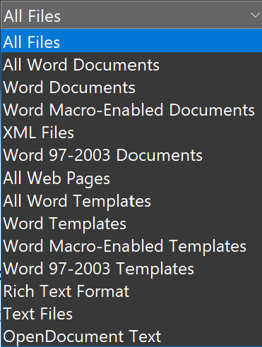
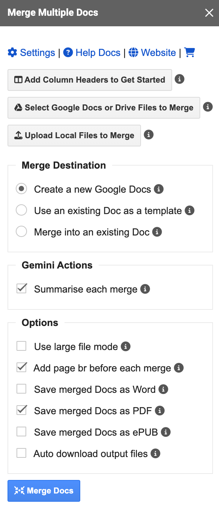
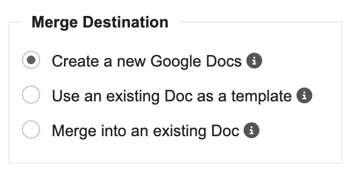
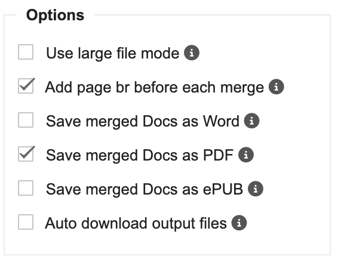

Combining multiple Word documents into a single cohesive file can significantly enhance productivity and streamline workflows, especially when dealing with complex projects or extensive documentation. Whether you need to merge reports, consolidate research, or create comprehensive manuals, having an efficient method to combine documents is essential. 

In this article, I'll explain two primary approaches for merging Word documents:

- Utilizing Microsoft Word's built-in insert feature 
- Using the third party add-on: Merge Docs Pro 

Each method offers distinct advantages and potential drawbacks, catering to different needs and preferences. By understanding the strengths and limitations of these approaches, you can make an informed decision on the best tool to simplify your document management tasks.

<!-- toc -->

## Watch the Demo Video

If you'd prefer to watch a video on How to Merge multiple Word Documents into one instead of reading the article, check out the following video:

<iframe
  width="560"
  height="315"
  src="https://www.youtube.com/embed/YgfLw0mKmfg"
  frameborder="0"
  allowfullscreen
></iframe>

## Combining Multiple Word Documents into One Using the Insert Option

If you're working with Microsoft Word and need to merge several documents, you can use the built-in Insert feature. Follow these steps to combine your files:

1. Select the *Insert* tab from the Ribbon.

   

2. Click on the *Object* option in the Text group, and then choose *Text from File* from the drop-down menu.

   

3. The file selection window will appear. You can choose from various file formats, including Word Documents, RTF files, and ODT Documents.

   

4. Select the files you want to merge and click *Insert*. All the selected documents will be added to the current Word document.

**Note:** You can also select Markdown files, but be aware that Markdown files will be inserted as plain text in the Markdown syntax rather than being converted to rich text format.

### Pros of using Insert Option

- **Built-In Feature**: No need for additional software or installation.
- **Easy Access**: Directly available within the Microsoft Word application.
- **Learning Curve** - No additional time is needed to learn as it is natively available in Word.

### Cons of using Insert Option

- **Merge Order** - Manual control over the merge order is challenging; you may need to rename files to ensure they are merged in the desired sequence.
- **Page Breaks** - It is not possible to automatically insert page breaks between the merged documents, which may require manual adjustments to ensure proper separation and formatting.
- **Formatting Limitations** - Markdown files will not be converted into rich text format, potentially affecting the appearance of the merged document.
- **Format Consistency** - The formatting of documents may not remain consistent after merging, which can require additional adjustments.
- **Export Limitations** - It is not possible to automatically export the merged document as a PDF or EPUB and download them automatically. Manual export and download are required.

## Merging Word Documents with Merge Docs Pro Add-On

Another option for merging multiple Word documents into one and keep the formatting intact is to use the Merge Docs Pro Google Workspace add-on. This add-on offers several advantages over the native insert option:

- **Control Over Merge Order** - You can easily reorder documents in the Google Sheet where they are listed, providing better control over the final merge order.
- **Format Consistency** - The formatting of documents remains consistent after merging and doesn't require any additional adjustments.
- **More File Types support** - Merge various types of files, such as Markdown, HTML, and others. These files will be automatically converted into rich text format, making it easier to combine output files from different toolsets into a cohesive single Word document.
- **Page Breaks** - Automatically insert page breaks between documents to enhance readability and give the merged document a professional appearance.
- **Automatic Export** - Export the merged document as a PDF or EPUB for easier sharing and distribution.
- **Download as Word File** - Download the merged document in Word format if needed.
- **Header and Footer Management** - Add headers and footers to the merged document, eliminating the need to include them in each individual document.

To get started, you need to install the [Merge Docs Pro](https://workspace.google.com/marketplace/app/merge_docs_pro/61337277026) add-on from the Google Workspace Marketplace.

Once the add-on is installed, 
1. [Open a new Google Sheets](https://sheets.new) <i class="fa fa-external-link" aria-hidden="true" style="color:blue"></i>&nbsp;.
2. Launch the Merge Docs Pro add-on from the menu *Extensions* -> *Merge Docs Pro* -> *Merge Multiple Docs* option. It will display the add-on sidebar as follows.

To start the merge process, follow the steps:

1. Click on the **Add Column Headers to Get Started** button. This will add headers to the Google Sheet, guiding you in correctly entering the input data.
2. If your Word files and other input files, such as Markdown files, are already stored in Google Drive, click on the **Select Google Docs or Drive Files to Merge** button. This will open the file picker, allowing you to select and add files to the input sheet for merging.
3. If your Word files and other input files are on your local drive, click on the **Upload Local Files to Merge** option. This will open the file selector. Choose all the files you want to upload and click OK. The files will be uploaded to Google Drive and listed in the sheet for merging. You can select various file types, such as Markdown, DOCX, HTML, RTF, ODT, and others.
4. To customize the merge order, reorder the entries in the Google Sheet as needed. You can also specify which files should be included in the merged document. To exclude a document from the merge, set the corresponding Merge Document option to 'No'.

Next, let's explore how to customize the merge operation and initiate the merging process.

### Selecting the Merge Destination

The Merge Docs Pro add-on supports three merge destination options:

1. **Create a New Document**: This option merges all your documents into a new, blank document.  
*Use this option when you want to start with a clean slate and combine multiple documents into a fresh file without any pre-existing content.*
2. **Use an Existing Document as a Template**: This option allows you to use an existing document as a template. The headers and footers from this document will be copied to the newly created merged document.  
*Choose this option if you need to maintain consistent formatting or branding by incorporating headers and footers from a pre-existing document.*
3. **Merge into an Existing Document**: This option merges the selected documents into an existing document of your choice.  
*Select this option when you want to append or integrate new content into an existing document, preserving its current layout and formatting.*

### Customizing the Merge Operation (Automatic File Exports and File Downloads)

You can customize the merge operation using various options provided by the Merge Docs Pro add-on.

- **Large File Mode**: Allocates up to 6 minutes to read and merge each file, allowing for the inclusion of documents with large amounts of text and media.
- **Add Page Break Before Each Merge**: Inserts a page break before merging each document to improve readability and ensure clear separation between documents.
- **Save Merged Docs as Word**: Automatically creates a Word file from the merged Google Docs, providing an easy-to-edit format.
- **Save Merged Docs as PDF**: Automatically generates a PDF file from the merged Google Docs, which is ideal for sharing and preserving document formatting.
- **Save Merged Docs as ePUB**: Automatically creates an ePUB file from the merged Google Docs, making it suitable for eReaders.
- **Auto Download Output Files**: Automatically downloads the output files, such as Word, PDF, or ePUB files, directly to your device.

### Merging the Documents

When you're ready, click on the *Merge Docs* button. The documents will be merged into one and the output file(s) will be created as per your configuration. Also, the files will be downloaded automatically. 

### Pros of Using Merge Docs Pro Add-On

- **Merge order control** - Reorder documents and customize the merge sequence easily.
- **Automatic Formatting** - Adds page breaks and supports headers and footers automatically.
- **Versatile File Types** - Merges various formats, including Markdown and HTML, converting them to rich text.
- **File Exports** - Exports merged documents to Word, PDF, and EPUB formats automatically.

### Cons of Using Merge Docs Pro Add-On

- **Learning Curve** - May require time to master the add-on’s features.
- **Google Workspace Requirement** - Requires a Google Workspace environment.

## Conclusion

Combining multiple Word documents can be achieved using either Microsoft Word's native insert feature or a third-party add-on like Merge Docs Pro. 

Both methods have their strengths and weaknesses. The native insert feature provides a basic method for merging documents but may require manual adjustments for formatting and page breaks. Merge Docs Pro offers advanced features, including automatic page breaks and customizable merge orders, but requires a Google Workspace environment. 

Choose the method that best meets your needs for merging documents.

## See Also

- [Combine Google Docs into One and Export to PDF](/merge-multiple-google-docs-into-one-and-export/)