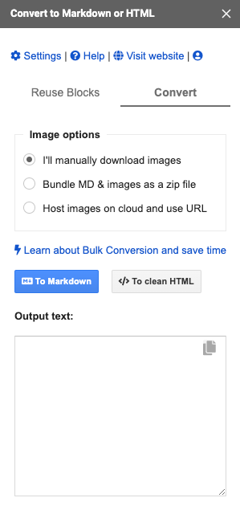
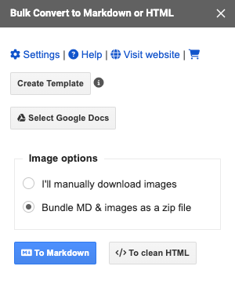
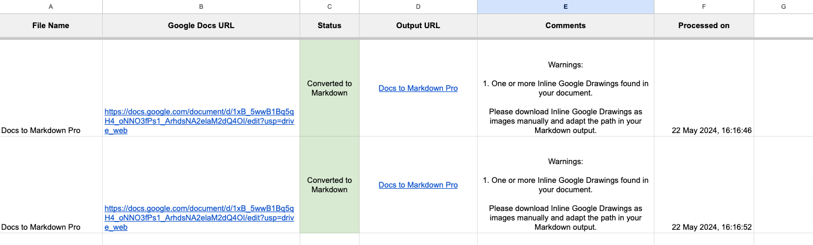
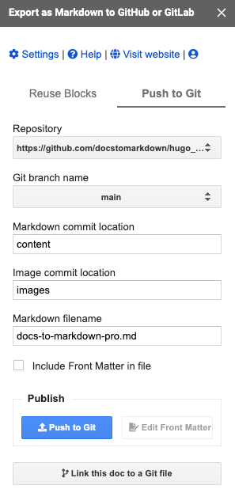

Markdown is a lightweight formatting language known for its ease of use and readability. 

Google Docs is a collaborative online word processor that is part of Google Workspace. But it doesn't natively support exporting documents in Markdown format.

**You can convert Google Docs to Markdown using the Google Docs Editor Add-on "Docs to Markdown Pro".**

In this tutorial, I'll show you how to export Google Docs to Markdown format using the Docs to Markdown Pro add-on and also what are the advanced features available in the add-on.

## Getting Started

To get started, install the [Docs to Markdown Pro](https://workspace.google.com/marketplace/app/docs_to_markdown_pro/483386994804) add on from the Workspace Marketplace.

## Converting Google Docs to Markdown

To convert [Google Docs to Markdown](https://www.docstomarkdown.pro), launch the add-on using the menu *Extensions* -> *Docs to Markdown Pro* -> *Convert Docs to Markdown/HTML* option.

The add-on sidebar will open as shown below:

1. Select the Image Handling Method. The supported options are *Manual Image Download*, *Download images in the output zip file*, and *Cloud Hosting Images*. The images will be handled based on this selection.
2. Click on the *To Markdown* option to convert the Docs to Markdown.

The document will be converted to Markdown format, and the output file will be downloaded automatically.

Now, let's look at the advanced features of the Docs to Markdown Pro add-on that can make the conversion process easier and save you time.

## Advanced Features

- **Settings** - It allows you to set the [default settings](https://docs.docstomarkdown.pro/settings) and save them. During each conversion, the same settings will be used
- **Auto Conversion Support** - You can enable the auto conversion setting. With this, the conversion process will start automatically without you clicking the *To Markdown* option after launching the add-on and this will be helpful if you're converting multiple docs
- **HTML Headings** - You can choose to create HTML headings instead of Markdown Headings. When you choose this, the headings available in the Document will be created as HTML headings with the ID. This will be helpful in creating jump links automatically when you publish the Markdown file
- **Table of Contents Support** - If you're using the native Google Docs Table of Contents, the add-on will automatically convert the TOC into the Markdown format
- **Accessibility checks** - You can also choose to enable the accessibility checks. This ensures accessibility with automatic [WCAG checks](https://en.wikipedia.org/wiki/Web_Content_Accessibility_Guidelines) for image alt text and heading levels. Your content will be inclusive and this also boosts SEO, helping more people find your content easily.
- **Syntax Customization** - You can customize the syntax. For example, you can choose between the emphasis character that you need to use the in the Markdown format. Either Underscore `_` or Asterik `*`

## Bulk Converting Google Docs to Markdown

The Docs to Markdown Pro supports bulk conversion. 

This feature is useful when you need to convert multiple documents into Markdown format.

To bulk convert Google Docs to Markdown format, follow the below steps:

1. Open a [new Google Sheets](https://sheets.new), and launch the add-on using the menu *Extensions* -> *Docs to Markdown Pro* -> *Bulk convert Docs to Markdown/HTML*. You'll see the following window in the sidebar:

   

2. Click on the *Create Template* button. This will create the necessary headers in the Google Sheet.

3. Use the *Select Google Docs* option to show the file picker. Select all the Google Docs you need to convert to Markdown format and click *OK*. The selected Docs will be added to the templated Sheet.

4. Click the *To Markdown* button. All the selected Google Docs will be converted to Markdown format, and the output file link will be added to the *Output URL* column. The status of each conversion will also be added in the status column. For successful conversions, the status will indicate success. For error conversions, the status will be set as Conversion error, and the reason for the error will be updated in the comments column.

## Git Integration

The Docs to Markdown Pro add-on integrates seamlessly with GitHub and GitLab.

If you're converting Google Docs to Markdown format to publish them in GitHub or GitLab using [static site generators](https://www.cloudflare.com/en-in/learning/performance/static-site-generator/) as part of your Docs as Code workflow, you can automate it using this add-on.

1. Launch the Git Publishing window using the menu *Extensions* -> *Docs to Markdown Pro* -> *Export as Markdown to GitHub or GitLab*. You'll see the following window in the sidebar:

2. Add the repository using the *Settings* option and configure the default image directory and default Git branch to commit your files to.
3. Start publishing the Google Docs as Markdown. Optionally, you can choose to automatically generate and include the Front Matter in the Markdown file. This is helpful when using static site generators such as [Hugo](https://gohugo.io/) or [Jekyll](https://jekyllrb.com/)
4. All images will be uploaded to Git automatically, and the image paths will be updated in the Markdown file.
5. When you need to update the document, you can seamlessly update it to Git with a single click.

## Conclusion

Docs to Markdown Pro simplifies the process of converting your Google Docs to Markdown format. With its user-friendly interface, advanced features like bulk conversion and Git integration, this add-on streamlines your workflow and saves you valuable time. So why wait?

Install [Docs to Markdown Pro](https://workspace.google.com/marketplace/app/docs_to_markdown_pro/483386994804?pann=b) today and start converting Google Docs to Markdown seamlessly.
