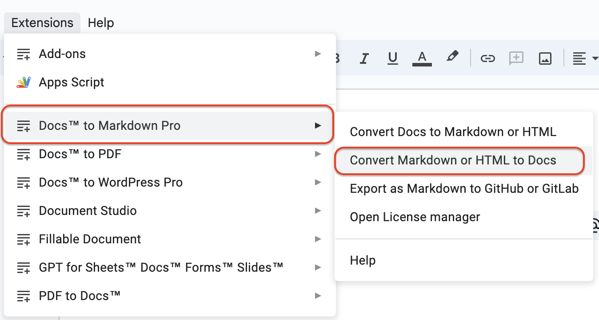
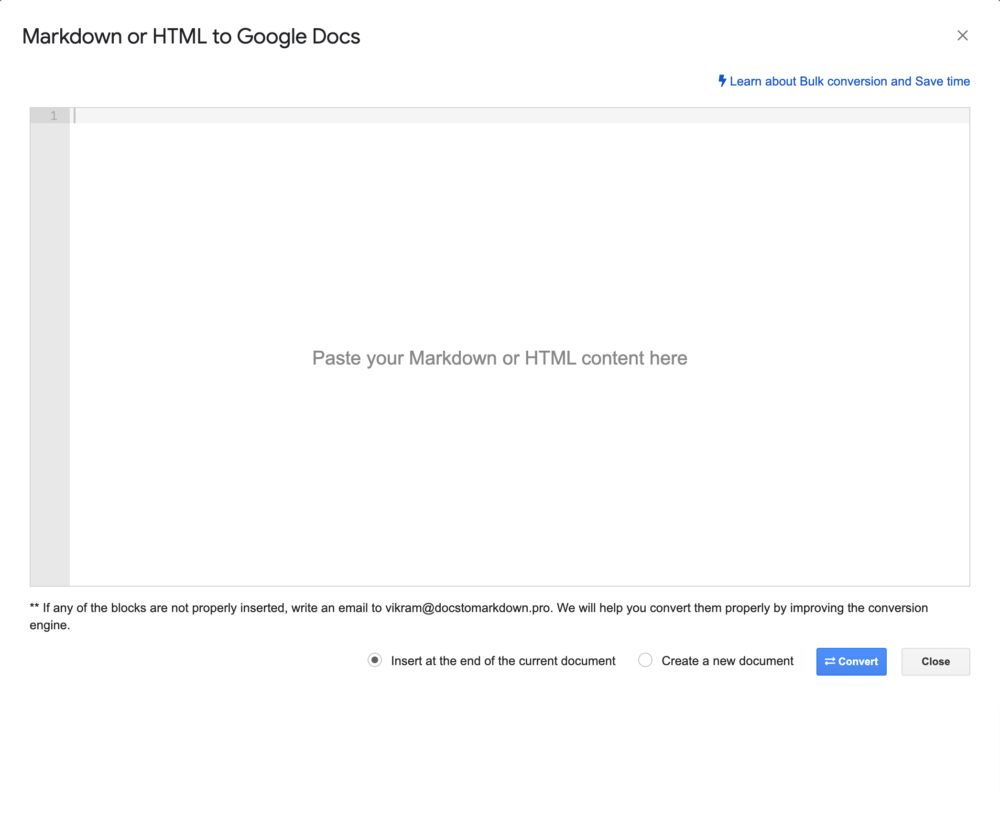
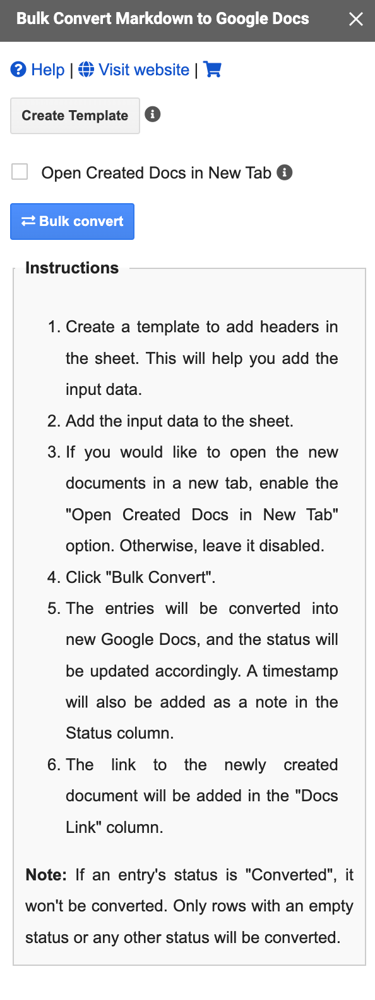
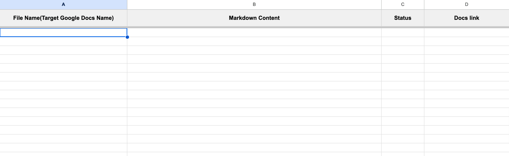

Markdown is a lightweight formatting language known for its ease of use and readability. The LLM tools such as ChatGPT and Gemini provide Markdown as the output. When you want to make it a document for further collaborative editing, you need to convert it to Google Docs.

Google Docs is a collaborative online word processor that is part of Google Workspace. But it doesn't natively convert Markdown text into rich text format.

**You can convert Markdown to Google Docs using the Google Docs Editor Add-on "Docs to Markdown Pro".**

In this tutorial, I'll show you how to import Markdown into Google Docs as rich text using the Docs to Markdown Pro add-on and also what advanced features are available in the add-on.

## Getting Started

To get started, install the [Docs to Markdown Pro](https://workspace.google.com/marketplace/app/docs_to_markdown_pro/483386994804) add on from the Workspace Marketplace.

## Converting Markdown to Google Docs

To convert [Markdown to Google Docs](https://www.docstomarkdown.pro/convert-markdown-to-google-docs-online/), launch the add-on using the menu *Extensions* -> *Docs to Markdown Pro* -> *Convert Markdown/HTML to Docs* option as shown in the following image:

It will open the Markdown to Google Docs dialog as shown below:

1. Enter your Markdown text on the input text box
2. Selec the desitation for the Markdown. *Insert at the end of the document* or *Create a new Document*
3. Click on the *Convert* button
4. The text will convert the Markdown into rich text and insert into the Google Docs.

Now, let's look at the advanced features of the Docs to Markdown Pro add-on that helps in Markdown to Google Docs conversion process

## Supported Markdown Syntaxes

- **HTML Headings** - All types of Markdown headings and HTML headings are supported. For example, a Markdown file might contain headings in the HTML format. These will be auto-recognized and inserted into Google Docs as Headings.
- **Images** - The [image URLs mentioned in the Markdown file](/add-images-to-readme-md-file-github/) will be retrieved and inserted into Google Docs if accessible publicly. If the [images are specified locally](/display-local-images-in-markdown/), you have to copy and place them manually in Google Docs.
- **Links** - The links specified in the Markdown files are auto-converted to hyperlinks.
- **Lists** - [Lists in the Markdown](/lists-in-markdown/) files are converted into ordered or unordered lists and inserted into Google Docs accordingly.
- **Code Blocks** - The [code blocks in the Markdown](/code-blocks-in-markdown/) (including fenced code blocks, indented code blocks, and also inline codes) are auto-detected and inserted into Google Docs.
- **Tables** - Markdown tables are automatically converted into tables in Google Docs.

## Bulk Converting Markdown to Google Docs

The Docs to Markdown Pro supports bulk conversion of Markdown into multiple Google Docs. 

To bulk convert Markdown into Google Docs format, follow the below steps:

1. Open a [new Google Sheets](https://sheets.new), and launch the add-on using the menu *Extensions* -> *Docs to Markdown Pro* -> *Bulk convert Markdown/HTML to Docs*. You'll see the following window in the sidebar:

2. Click on the *Create Template* button. This will create the necessary headers in the Google Sheet as shown below:

3. Add the file name, and the Markdown text in the sheets

4. Click the *Bulk Convert* button. All the Markdown text will be converted into Google Docs, and the output file link will be added to the *Docs Link* column. The status of each conversion will also be added in the status column. For successful conversions, the status will indicate success. For error conversions, the status will be set as Conversion error, and the reason for the error will be updated in the comments column.

## Conclusion

Docs to Markdown Pro simplifies the process of converting your Markdown into Google Docs format. With its user-friendly interface, advanced features like bulk conversion, this add-on streamlines your workflow and saves you valuable time. So why wait?

Install [Docs to Markdown Pro](https://workspace.google.com/marketplace/app/docs_to_markdown_pro/483386994804?pann=b) today and start exporting Markdown into Google Docs.
