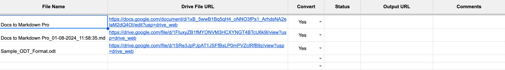
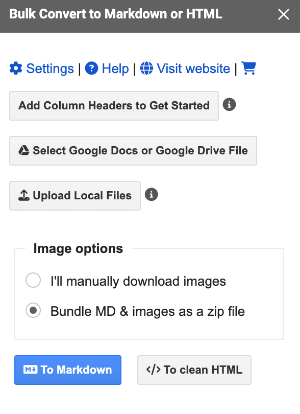

Word documents are widely used for creating and sharing content due to their robust formatting options and ease of use. However, when it comes to publishing content online or collaborating with developers, converting these documents to Markdown format is often necessary. 

Markdown is a lightweight markup language that’s easy to read and write, making it ideal for online platforms like GitHub, blogs, and documentation sites.

One of the challenges in converting Word documents to Markdown is preserving the document’s formatting and embedded elements, such as inline images and links. These elements are crucial for maintaining the document's structure and ensuring that all the necessary information is retained during the conversion process.

This tutorial explains how to convert the Word to Markdown format with images using the online tool and a thrid party Google Workspace add-on Docs to Markdown Pro. 

<!-- toc -->

## Convert Word to Markdown using Online Tool

To convert Word to Markdown online, you can use the [Word to Markdown Online](/convert-word-to-markdown/) tool. 

This tool allows you to copy and paste your Word document content into the input text box and instantly get the converted Markdown format in the output text box.

Here's how to use the online converter:

- **Copy your Word document content** - Select and copy the content from your Word document.
- **Paste into the input text box** - Paste the copied content into the input text box on the online converter page.
- **Get the Markdown output** - The tool will automatically convert the pasted content into Markdown format and display it in the output text box.
- **Copy or download the Markdown output** - You can either copy the Markdown output from the output text box or download it as a .md file using the download option.

The online converter supports various Markdown styles, including:

- **Links** - Convert Word document links to Markdown links.
- **Footnotes** - Convert Word document footnotes to Markdown footnotes.
- **Code Blocks** - Convert Word document code blocks to [Markdown code blocks](/code-blocks-in-markdown/).
- **Headings** - Convert Word document headings to Markdown headings.
- **Bold and italic text** - Convert Word document bold and italic text to Markdown bold and italic text.
- **Lists** - Convert Word document lists to [Markdown lists](/lists-in-markdown/).

This online converter is a convenient solution for those who need to convert Word document content to Markdown format without any hassle.

**Note:** Please be aware that this online converter does not support downloading images embedded in the Word document. If your Word document contains images, they will not be included in the converted Markdown output. To download images from your Word document, please refer to the next section for a tutorial.

## Convert Word to Markdown With images using Docs to Markdown Pro

To convert Word documents to Markdown, including images, links, and other elements, you can utilize the Google Workspace add-on Docs to Markdown Pro.

**Key Features**

- **Batch Conversion** - Upload multiple Word documents and convert them to Markdown or HTML format with a single click.
- **Image Inclusion** - The add-on preserves images in the original Word document and includes them in the converted Markdown output.
- **Link Preservation** - Links in the Word document are maintained in the converted Markdown output.
- **ZIP File Download** - Download the converted output, including images, as a  ZIP file for easy publishing.

To get started, install the [Docs to Markdown Pro](https://workspace.google.com/marketplace/app/docs_to_markdown_pro/483386994804) add on from the Workspace Marketplace.

Once installed, launch the add-on from the Google Sheets menu *Extensions* -> *Docs to Markdown Pro* -> *Bulk Convert Docs to Markdown/HTML* option.

1. Click on the button *Add Column Headers to Get Started* option. It will add the necessary headers to help you add the input in the right way.
2. To upload the Word Documents for converting, click on the *Upload Local Files* option and select all the Word files you need to convert to Markdown. After uploading the files, the input sheet will look like the one below:

   

3. After uploading the files, click on the *To Markdown* option.

   

4. All the uploaded Word files will be converted to Markdown format, and the output URL will be updated in the *Output URL* column.
5. You can also choose to download the output files automatically in the *Settings* window.

**Security and Privacy**

The conversion process with Docs to Markdown Pro is private and secure, as the conversion takes place entirely within your Google account. Your data is not uploaded to any external servers for conversion, ensuring complete protection of your information.

## Conclusion

Converting Word documents to Markdown format can be simplified with the right tools. This article explored two methods: using an online converter for straightforward conversions and utilizing the Google Workspace add-on **Docs to Markdown Pro** for more complex tasks involving images and links.

By following the steps outlined in this tutorial, you can ensure that your Word documents are converted to Markdown with precision, preserving the original formatting and content.

It's important to remember that the Docs to Markdown Pro add-on operates exclusively within the Google Sheets environment, requiring a Google account and access to Google Sheets.

## See Also

- [Convert Markdown to Word](/convert-markdown-to-word/)
- [Convert Google Docs to Markdown](/convert-google-docs-to-markdown-online/)

