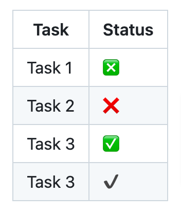

GitHub Markdown supports the creation of checkboxes, which are useful for creating task lists or tracking progress on projects.

**You can create checkboxes in GitHub Markdown using the `[x]` syntax for checked checkboxes and `[ ]` for unchecked checkboxes.**

In this tutorial, I'll demonstrate how to create checkboxes in GitHub Markdown including checkboxes as lists and checkboxes inside tables and the nested checkboxes. 

<!-- toc -->

## Drawing Checkbox in GitHub Markdown

The unchecked checkboxes are created using square brackets with a space between them, whereas the checked checkboxes are created by replacing the space with an `x` between the square brackets.

To create a checkbox or a tick mark in the GitHub flavoured Markdown, use the following syntax:

```
- [] Task 1
- [x] Task 2 (completed)
- [ ] Task 3
```

It will create a checkbox list as below: 


To mark a task as completed,  change `[ ]` to `[x]`. If you're working in GitHub issues, you can also check the checkboxes directly.

[GitLab Flavoured Markdown is based on the GitHub flavoured Markdown(GFM)](https://docs.gitlab.com/ee/development/gitlab_flavored_markdown/specification_guide/#summary). Hence, you can use the same syntax to create checklists in the GitLab Markdown files. 


**Important Points to Note about Checkboxes in GitHub**

- Checkboxes are interactive only in GitHub Issues. You can enable or disable them to denote if a specific task is completed or not in that issue
- Even in GitHub issues, Checkboxes are rendered as checkboxes only when used outside of tables. Inside tables, they are **not** rendered as checkboxes but only as Markdown text
- Checkboxes used in other Markdown files, such as `readme.md` files, are not interactive


## Markdown Nested Checkboxes

Nested checkboxes are useful for creating subtasks within a main task. To achieve this, create a nested list and indent the list items containing the checkbox syntax.

The following syntax shows how to create a nested checkboxes in the Markdown:

```
- [ ] Main Task
  - [ ] Subtask 1
  - [ ] Subtask 2
  - [x] Subtask 3
```

It will create the nested checkboxes as show below. 


## Drawing Checkbox in GitHub Markdown Table

GitHub Flavored Markdown (GFM) doesn't support interactive checkboxes directly within tables.

To insert checkboxes or a tick mark representation into tables in GitHub Markdown, use the checkbox syntax inside the table columns. *However, they will not be rendered as interactive checkboxes but only as square brackets, which can help in creating a similar checkbox appearance for inferring the meaning.*

Alternatively, to create a tick mark inside the table columns for comparisons, you can use emojis as explained in the next section of this tutorial.

The following Markdown table code shows how to create checked and unchecked checkboxes inside the table:


```
| Task         | Status    |
|--------------|-----------|
| Task 1       | [ ]       |
| Task 2       | [x]       |
| Task 3       | [ ]       |
```

The above code will render a table as follows:


## Creating Green Checkboxes or Using Emojis in the Markdown Table

GitHub Markdown does not support colored checkboxes directly, but you can use emojis as a visual alternative to checkboxes in Markdown. However, these emojis are not interactive like checkboxes. 

Check the [list of supported emojis list](https://gist.github.com/rxaviers/7360908).

Here’s an example of how to use emoji checkboxes:

```
| Task         | Status    |
|--------------|-----------|
| Task 1       | :negative_squared_cross_mark:      |
| Task 2       | :x:|
| Task 3       | :white_check_mark:       |
| Task 3       | :heavy_check_mark:       |

```

This will create the following output: 




Using emojis allows for a more colorful and visually appealing checklist, especially when combined with other text formatting options in Markdown.

You can use this method to create a comparison table in the readme.md file, for example. However, you cannot use them for creating todo list type of activites. 

This is all about the checkboxes or Tickmarks in the GitHub. 