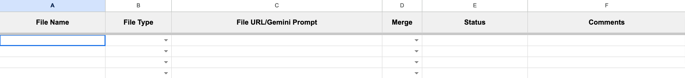

In collaborative environments, users often write in separate Google Docs to focus on specific sections of a project, streamline revisions, and manage components efficiently. However, combining these documents into a single cohesive file is often necessary for creating deliverables.

In this tutorial, I'll explain how to [merge multiple Google Docs into one](https://www.mergedocs.pro), add page breaks for clarity, and customize the document with headers and footers. I'll also show you how to merge various formats like Word, Markdown, and HTML with Google Docs and export the merged documents as PDF or EPUB files, making them ready for delivery or sharing.

<!-- toc -->

## Prerequisite

Google Docs doesn't provide a built-in merging feature. Hence, you need to use an add-on to merge multiple Google Docs. Merge Docs Pro is a suitable add on to merge multiple Google Docs into one.

[Install the Merge Docs Pro add-on ](https://workspace.google.com/marketplace/app/merge_docs_pro/61337277026)<i class="fa fa-external-link" aria-hidden="true" style="color:blue"></i>&nbsp; from the Google Workspace Marketplace. Once the add-on is installed, you can follow the below steps to merge the documents. 

## Merging Google Docs into One (Step By Step)

Merge Docs Pro is an add-on that works with Google Sheets, allowing you to add input documents to be merged, control the merge order, and use a merge flag to specify which files to merge for specific deliverables.  This feature allows you to reuse the same sheet and create customized documents for different stakeholders. For example, excluding sensitive information from a report intended for public release or creating a condensed version for executive review.

1. To begin the merging process, [Open a new Google Sheets](https://sheets.new) <i class="fa fa-external-link" aria-hidden="true" style="color:blue"></i>&nbsp;.
2. Launch the Merge Docs Pro add-on from the menu *Extensions* -> *Merge Docs Pro* -> *Merge Multiple Docs* option. This will display the add-on sidebar as shown below:

3. **Adding Sheet Headers** - Click on the *Add Column Headers to Get Started* option to add the necessary headers in the Google Sheets. This will help you add the input in the correct format for merging. If you opt to add the Google Docs directly using the *Select Docs to Merge* option, it will add the necessary headers for the first time. The sheets with headers will look like the following image: 

4. **Selecting Documents to Merge** - Click on the *Select Google Docs or Drive File to Merge* button. It will display the File picker, allowing you to select desired Google Docs to merge. Select the documents and click on the *Select* button.

All the selected documents will be added to the input sheet and the input type will be detected automatically as Google Docs. 
5. **Customizing the Merge Order and setting the Merge flag** - Once the Docs are added to the sheet, you can reorder them to the desired merge oder. Additionally, you can set the Merge flag to No, if you want to ignore any document for a specific deliverable. The final input sheet for merging will look like the one below: 

6. **Merging the Docs** - When the input is ready, click on the **Merge Docs** button. The documents with the Merge Docs flag set to *Yes* will be merged together and a new Google Docs will be created. The final output Google Document will be opened automatically in the new tab for your easier access.

**Note:** When you combine multiple Google Docs into one using this add-on, the original files are unchanged and kept intact. Only the contents are read and merged into the destination document.

## Merging Various Document Formats with Google Docs

The Merge Docs Pro add-on offers even more flexibility, enabling you to merge not only multiple Google Docs into one, but also combine various document formats, such as Word, Markdown, and HTML, into a single Google Doc. *This feature is particularly useful when you need to consolidate output from different tools in your workflow into a single output document.*

The supported documents to merge are, *Google Docs*, *Markdown Files*, *HTML files*, *Rich Text Format* Files, *Microsoft Word documents*, *Open Document format* files, and *plain text* files. 

The input sheet for merging various format will look like the one below: 

## Adding Page Break Before Each Merge

When combining multiple Google Docs or other formats into one, adding page breaks between each document is essential for clarity and organization. This feature helps to:

- Improve readability by visually distinguishing between different documents
- Enhance navigation by separating each document with a page break
- Give your merged document a professional appearance

To add a page break before each merge using Merge Docs Pro,  enable the option **Add page br before each merge** option in the options section as shown below and click the *Merge Docs* button.

By adding page breaks between each merged document, you can create a well-organized and easy-to-read document that effectively communicates your content.

## Customizing the Output Document with a Header and Footer

When merging multiple Docs into one, adding a header and footer to the output document is essential for maintaining a professional and organized appearance.

Including a header and footer in your merged document serves several purposes:

- Enhances readability of the document
- Adds context by including page numbers, dates, and other metadata
- Maintains consistency in your deliverables

You don't need to include headers and footers in each of the input documents. 
Instead, Merge Docs Pro can copy them over from a template file to the output file. This saves time and effort, as you only need to set up the header and footer once in the template file. 

*Additionally, the template file remains unchanged during this process, making it reusable for multiple merges.*

To customize the output document with a header and footer using Merge Docs Pro, follow these steps:

1. Select the *Use an existing Doc as a template* option in the Merge Destination section as shown below.

2. Select the Google Docs template file which contains the necessary and header and footer information. 
3. Click the Merge Docs button to start the merge process. During the merge process, the header, footer, and language setting of the template document will be copied to the newly created output document.

**Automating the Access Settings of the Merge Document and Output Files:**

If you want to share the merged document or the output files with specific individuals by default, you can automate this process using this template document option. The access settings of the template Google Docs will be applied to the newly created merge document and also to the output files, such as ePUB and PDF files (Output files are explained in the next section).

## Exporting the Merged Document as PDF or EPUB or Word

Exporting your merged document as a [PDF](https://www.adobe.com/acrobat/about-adobe-pdf.html) or [EPUB](https://en.wikipedia.org/wiki/EPUB) file offers significant advantages, making it easier to distribute and present your content effectively.

- PDFs are ideal for maintaining consistent formatting and layout across different devices and platforms, ensuring that your document appears exactly as intended. This format is widely supported and can be easily shared with clients, stakeholders, or a broad audience, making it perfect for professional reports, presentations, and any content where layout and design are crucial. Additionally, PDFs provide options for security, such as [password protection](https://www.adobe.com/in/acrobat/online/password-protect-pdf.html) and permissions, which is valuable for safeguarding sensitive information.

- EPUB files are particularly useful for creating e-books and digital publications. The EPUB format supports reflowable text, which adapts to different screen sizes and enhances readability on various devices like e-readers, tablets, and smartphones. This makes it an excellent choice for authors, publishers, or anyone looking to distribute content in a digital book format. EPUB files can also include interactive features such as hyperlinks and multimedia, adding dynamic elements to educational materials, guides, or interactive reports. 

Overall, exporting the merged documents to PDF or EPUB ensures it is accessible, professional, and well-suited for its intended audience.

To export the merged document as a PDF, EPUB or Word automatically, follow the steps below:

- Enable the *Save merged Docs as PDF* option if you wish to export as a PDF.
- Enable the *Save merged Docs as ePUB* option if you wish to export as an ePUB.
- Enable the *Save merged Docs as Word* option if you wish to export as a Word File.

As mentioned in the previous section, the output files can be automatically shared with others if you choose to merge based on the template. The access settings of the template Google Docs will be applied to the the output files.

## Managing Large Documents

The Merge Docs Pro add-on includes a *Large File mode*, which is useful when merging large documents containing a substantial amount of text, images, and other media. When using Large File mode, each document is given a maximum of 6 minutes to be copied to the target document, as this is the maximum time allowed for a function to run in [Google Apps Script](https://developers.google.com/apps-script).

However, there is no limit to the number of documents you can merge at once. You can choose to merge any number of documents and use *Large File mode* when the input documents are too large to be read and merged efficiently.

To read more about the apps script quota, visit the [quotas page](https://developers.google.com/apps-script/guides/services/quotas).

## Configuring Default Settings for the Merge

The Merge Docs Pro add-on allows you to configure default settings to streamline the document merging process. By setting these defaults, you can ensure that each time the add-on is launched, it applies your preferred settings automatically, minimizing the need for manual adjustments.

To configure defaults, click on the Settings link at the top of the sidebar as show below.

The settings dialog will be displayed as below: 

In the Settings window, you can specify default options such as the *Merge Destination*, *Large file mode*, *Page break inclusion*, and export formats (PDF or EPUB). 

Configuring these settings in advance ensures consistency and efficiency, allowing you to focus on the content rather than repeatedly setting preferences.

## Security and Privacy Considerations

According to the [privacy policy](https://www.mergedocs.pro/privacy-policy) of Merge Docs Pro, the add-on does not collect the content of Google Docs or any other documents in any way. 

The merge operation takes place entirely within the user's Google account and Google Servers and is not uploaded to any external servers.

## Troubleshooting

When using Google Docs add-ons, you might encounter issues if you have multiple Google accounts logged in simultaneously. This is primarily due to [authorization conflicts](https://issuetracker.google.com/issues/69270374). 

If you face any error while launching the add-on, try signing out of all accounts, then sign in with the desired account and authorize the add-on again and launch it.

## Conclusion

Merge Docs Pro is an add-on that simplifies the process of merging multiple Google Docs, as well as various document formats, into a single Google Doc. With its user-friendly interface and advanced features, you can efficiently manage and organize your documents, making them ready for delivery or sharing. You can also use the same add on to merge multiple Word documents into one or other file formats.

For more detailed information and troubleshooting, please refer to the [Merge Docs Pro documentation](https://docs.mergedocs.pro/). The documentation provides comprehensive guidance on using the add-on, as well as answers to frequently asked questions.

By following the steps outlined in this tutorial and utilizing the Merge Docs Pro add-on, you can combine different google docs into one, save time and streamline your document management process, ensuring that your deliverables are well-organized and professional. 

## You May Also Like

- [Convert Google Docs to Markdown](/convert-google-docs-to-markdown/)
- [Convert Word to Markdown](/convert-word-to-markdown/)
- [Convert HTML to Word](/convert-html-to-word/)