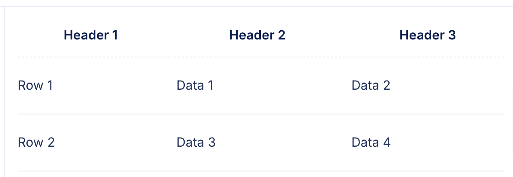
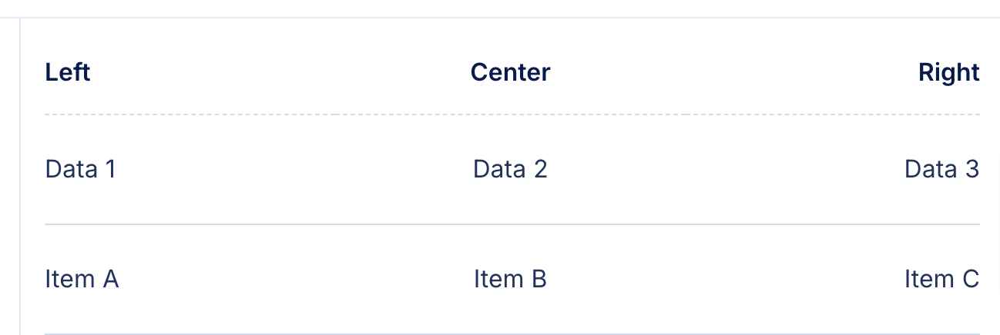
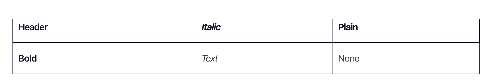
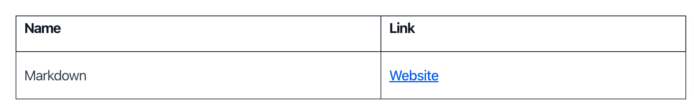

Tables play a crucial role in organizing and presenting data effectively, making information easier to understand and analyze. Markdown supports table creation through its native syntax and various extended formats, offering flexibility to cater to diverse needs across platforms.

In this tutorial, I'll teach you how to create tables in Markdown, align text inside the Markdown table, and advanced formatting techniques.

<!-- toc -->


## Basic Markdown Table Syntax  

**To create tables in Markdown, use `|` to separate columns and `-` to define headers.**

The `|` character is used to separate each column, while the `-` line under the header row defines the structure of the table, ensuring proper alignment and readability.

For example:

```
| Header 1 | Header 2 | Header 3 |
|----------|----------|----------|
| Row 1    | Data 1   | Data 2   |
| Row 2    | Data 3   | Data 4   |
```

This will be rendered as the following image: 



This basic syntax creates a simple table with three columns and two rows of data. Markdown tables are primarily designed for simplicity and readability, making them ideal for use in plain text environments like README files, documentation, and wikis.

In addition to basic table creation, Markdown allows you to control the alignment of the content within the columns. Alignment is specified using colons (`:`) in the separator row:

- `:---` aligns the text to the left.
- `:---:` aligns the text to the center.
- `---:` aligns the text to the right.

Here’s an example that demonstrates different alignment settings:

```
| Left   | Center | Right  |
|:-------|:------:|-------:|
| Data 1 | Data 2 | Data 3 |
| Item A | Item B | Item C |
```

This will be rendered as the following image: 



This syntax helps to present data in a clean, organized manner, which can be particularly useful when presenting numerical data, lists, or any content that benefits from structured organization. 

While Markdown tables have their limitations (like lack of support for merged cells), they offer a convenient and readable method for displaying structured data without needing complex formatting.

## Markdown Tables Without Headers  

Markdown tables can be created without headers by omitting the separator line (`---`). This results in a table that lacks formal headers but still organizes content in rows and columns. 

This simplified format is often used for basic lists or data where the column names are either unnecessary or implied. 

For example:

```
| Data 1 | Data 2 | Data 3 |
| Data 4 | Data 5 | Data 6 |
```

Tables without headers are useful in several contexts:
- When the data does not require explicit column labels, such as when listing items or providing simple comparisons.
- In situations where the data structure is straightforward and the context makes the meaning of each column clear, such as in a series of values or numeric data that doesn't need a header row.
- In informal documents or personal notes, where the simplicity of the table format is preferred over formality.

However, there are some limitations:
- **Lack of clarity**: Without headers, readers may find it difficult to understand what each column represents, especially if the content is complex or unfamiliar.
- **Accessibility issues**: Screen readers and other accessibility tools rely on headers to identify the role of each column, so tables without headers may not be as accessible to users with disabilities.
- **Rendering inconsistencies**: Some Markdown viewers or platforms may present these tables as less structured, which can lead to a less professional or organized appearance.

While omitting headers can make a table simpler, it's important to weigh these limitations against the clarity and accessibility needs of your audience.

## Formatting Content Within the Table  

Markdown allows various formatting options within table cells, enhancing the content's readability and structure. Here are some common formats you can apply within Markdown tables:

- **Bold and Italics**: You can use `**` for bold and `_` for italics. For example:
  ```
  | **Header** | _Italic_ | Plain |
  |------------|----------|-------|
  | **Bold**   | _Text_   | None  |
  ```

    This will be rendered as the following image: 

    

- **Links**: Markdown supports creating clickable links in table cells. It also supports [relative links](/relative-links-in-markdown/). For example:

  ```
  | Name        | Link                         |
  |-------------|------------------------------|
  | Markdown    | [Website](https://example.com) |
  ```

    This will be rendered as the following image: 

    

- **Images**: You can include images within tables using the `` format. For example:
  ```
  | Image       | Description        |
  |-------------|--------------------|
  |  | Sample image text  |
  ```

- **Code**: You can display inline code by wrapping text in backticks. For example:
  ```
  | Code Example |
  |--------------|
  | `print("Hello")` |
  ```

It’s important to note that compatibility with certain Markdown renderers may vary:

- Some platforms may not fully support all types of formatting, such as images or advanced link handling, within tables.
- More complex formatting (e.g., nested tables or custom styles) may require HTML, which could be better supported in specific environments like GitHub or Jupyter Notebooks.
- Always test your tables on the intended platform to ensure the content displays correctly. 

## Advanced Features in Markdown Tables  

Advanced features in Markdown tables allow for greater flexibility in organizing data. Here are some capabilities and workarounds:

- **Adding Multiple Rows and Columns**: To expand a table, simply add more rows and columns by continuing the use of `|` for columns and `-` for separating the header. For example:
  ```
  | Header 1 | Header 2 | Header 3 | Header 4 |
  |----------|----------|----------|----------|
  | Row 1    | Data 1   | Data 2   | Data 3   |
  | Row 2    | Data 4   | Data 5   | Data 6   |
  | Row 3    | Data 7   | Data 8   | Data 9   |
  ```

- **Combining Cells (Merging)**: Native Markdown does not support merged cells for rows or columns. To achieve this, use HTML within your Markdown file or rely on platform-specific plugins that offer support for merged cells. For example:
  ```
  <table>
    <tr>
      <td colspan="2">Merged Column</td>
      <td>Regular Cell</td>
    </tr>
    <tr>
      <td>Row 2, Cell 1</td>
      <td>Row 2, Cell 2</td>
      <td>Row 2, Cell 3</td>
    </tr>
  </table>
  ```

These advanced features provide greater control over table structure and content, though they may require workarounds depending on the Markdown renderer used.  

## Using HTML Tables in Markdown
  
HTML tables in Markdown are useful for more complex formatting that native Markdown cannot handle. 

- **When to Use HTML for More Complex Table Formatting**: Use HTML when you need features like merged cells, custom styling, or advanced attributes that Markdown tables don't support. HTML allows for better control over the table's appearance and structure.
- **Example of HTML in Markdown**: You can embed HTML directly within Markdown to create more complex tables. For example:
  ```
  <table>
      <tr>
          <td><b>Bold</b></td>
          <td><i>Italic</i></td>
      </tr>
      <tr>
          <td><a href="https://example.com">Link</a></td>
          <td>Plain text</td>
      </tr>
  </table>
  ```
- **Compatibility Issues and Rendering Differences**: HTML tables may not render consistently across different Markdown platforms. Some Markdown viewers may strip out HTML or render it incorrectly. It's important to check compatibility with the platform you are using, especially for advanced HTML elements and attributes. 

## Creating Tables in GitHub-Flavored Markdown (GFM)  

[GitHub-Flavored Markdown](https://github.github.com/gfm/) (GFM) fully supports basic Markdown tables, making it an essential tool for organizing content in GitHub repositories. GFM tables are simple to create and are often used for presenting structured information without the need for complex formatting.

- **Overview of GFM's Support for Markdown Tables**: GFM allows for the creation of tables using the standard Markdown syntax with the `|` character for columns and `-` for row separators. However, GFM does not support advanced features like cell merging or custom styling, making it best suited for basic tabular data presentation. While it doesn’t support HTML table elements as comprehensively as native HTML, it does allow for some HTML integration.
- **Example of a GFM Table**: Here's a basic table formatted in GFM to illustrate its simplicity and functionality:
  ```
  | Feature        | Supported |
  |----------------|-----------|
  | Basic Syntax   | Yes       |
  | HTML Tables    | Partial   |
  ```
- **Common Use Cases for GFM Tables**: GFM tables are widely used in various contexts within GitHub repositories:
  - **README Files**: Tables are commonly included in README files to organize information such as feature lists, configuration settings, or project statuses.
  - **Documentation**: Tables help structure documentation, such as API references, installation guides, or compatibility charts.
  - **Issue and Pull Request Descriptions**: GitHub users often use tables in issues and PRs to organize information or compare features, making communication clearer.
  
Despite its limitations, GFM's table support is highly practical for projects hosted on GitHub, offering an efficient way to structure data with minimal complexity.

## Creating Tables in Jupyter Notebook Markdown  

Jupyter Notebooks provide great flexibility when using [Markdown cells](https://jupyter-notebook.readthedocs.io/en/stable/examples/Notebook/Working%20With%20Markdown%20Cells.html#), allowing users to combine text, code, and visual outputs in an interactive environment. Markdown tables in Jupyter are ideal for presenting structured data alongside code execution results.

- **Flexibility of Markdown Cells in Jupyter Notebooks**: Markdown cells in Jupyter Notebooks support standard Markdown syntax for formatting, enabling the inclusion of tables, headings, lists, and more. This makes it easy to organize and display content alongside Python code and output. The rendered Markdown is instantly visible, allowing for an efficient, user-friendly experience.
- **Example of a Markdown Table**: Here's a simple table created with Markdown syntax in a Jupyter Notebook:
  ```
  | Column A | Column B |
  |----------|----------|
  | Value 1  | Value 2  |
  ```
- **Using HTML Tables in Jupyter for Advanced Formatting**: While basic Markdown tables work well in Jupyter, more complex formatting, such as merged cells, custom styling, or incorporating embedded images, can be achieved by using HTML. Jupyter supports the direct inclusion of HTML, which provides additional flexibility for designing tables. For example:
  ```html
  <table>
    <tr>
      <td><b>Bold</b></td>
      <td><i>Italic</i></td>
    </tr>
    <tr>
      <td><a href="https://example.com">Link</a></td>
      <td>Plain text</td>
    </tr>
  </table>
  ```

- **Using Tools like Pandas for Generating Markdown-Compatible Tables**: For more complex data, such as dataframes, tools like pandas can be used to automatically generate tables that are compatible with Markdown. This can be useful when working with datasets in Jupyter. For example, converting a pandas DataFrame to a Markdown table can be done with the `.to_markdown()` method:
  ```python
  import pandas as pd
  df = pd.DataFrame({'Column A': [1, 2], 'Column B': [3, 4]})
  df.to_markdown()
  ```

This combination of Markdown and HTML within Jupyter Notebooks allows for efficient, clear presentation of both simple and complex data, while leveraging Python for dynamic table generation.


## Accessibility and Compatibility Considerations  

When creating tables in Markdown, ensuring accessibility and compatibility is essential for a smooth user experience across platforms.

- **Ensure Table Content is Readable on Smaller Screens**: Use shorter column names and limit the number of columns to enhance readability on mobile devices. For larger tables, consider breaking them into smaller sections for easier viewing.
- **Add Clear Headers for Accessibility Tools like Screen Readers**: Provide clear, descriptive headers to help screen readers interpret table content. In Markdown, the first row should act as the header, separated by `-`, or use HTML `<th>` elements for better structure.
- **Consider Fallback Options for Viewers that Don’t Fully Render Markdown Tables**: Some platforms may not fully support or correctly render Markdown tables. Provide fallback options like downloadable CSV files or text-based alternatives for compatibility. 

## Conclusion  

In conclusion, Markdown offers multiple methods for creating tables, each suited to different needs:

- **Standard Markdown Syntax**: Ideal for simple tables with minimal complexity.
- **HTML Tables**: Best for advanced formatting, such as merged cells and custom styles.
- **Third-Party Tools (e.g., pandas)**: Useful for generating dynamic, data-driven tables from external data.

The choice between these options depends on the complexity of your data and specific use case. For basic tables, Markdown syntax is sufficient, while HTML provides greater flexibility for advanced formatting.

Always ensure your tables:
- Are accessible by adding clear headers for screen readers.
- Are mobile-friendly by keeping them simple and readable on smaller screens.
- Provide fallback options, such as CSV or text alternatives, for compatibility across different platforms.

Following these best practices will ensure a better user experience and improve both accessibility and compatibility.

## See Also

-[Create Table of Contents in Markdown](/create-a-table-of-contents-in-markdown/)